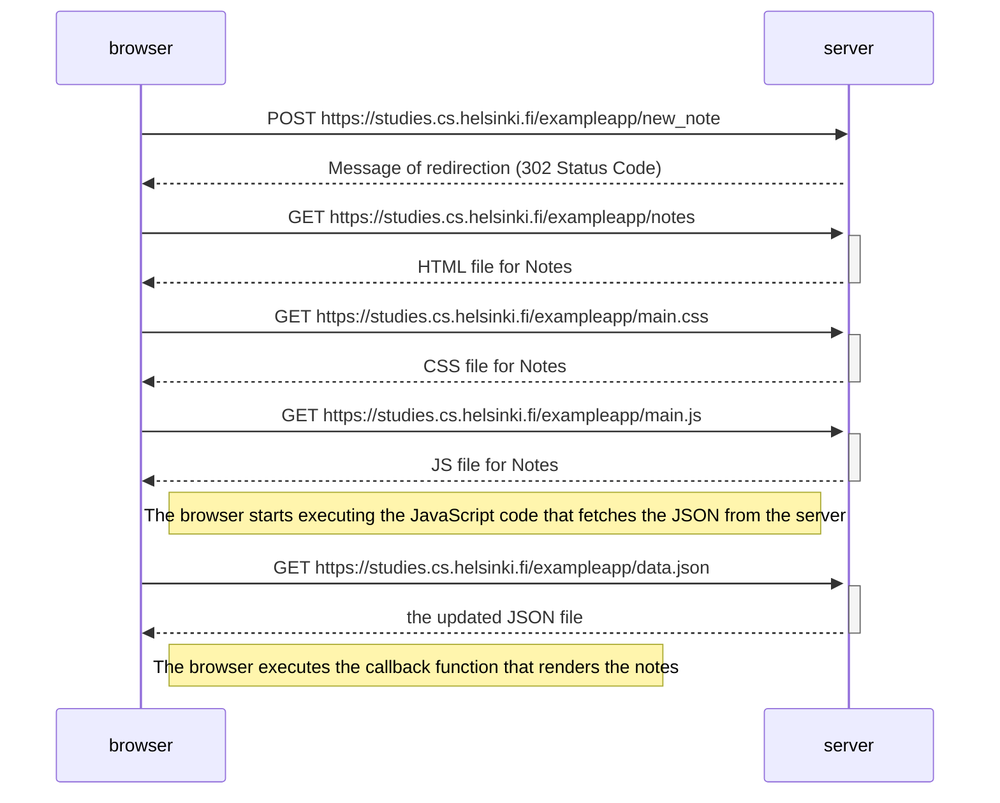

```mermaid
sequenceDiagram
    participant browser
    participant server

    browser->>server: POST https://studies.cs.helsinki.fi/exampleapp/new_note
    
    activate server
    server-->>browser: Message of redirection (302 Status Code)

    browser->>server: GET https://studies.cs.helsinki.fi/exampleapp/notes
    
    activate server
    server-->>browser: HTML file for Notes
    deactivate server

    browser->>server: GET https://studies.cs.helsinki.fi/exampleapp/main.css
    activate server
    server-->>browser: CSS file for Notes
    deactivate server

    browser->>server: GET https://studies.cs.helsinki.fi/exampleapp/main.js
    activate server
    server-->>browser: JS file for Notes
    deactivate server

    Note right of browser: The browser starts executing the JavaScript code that fetches the JSON from the server

    browser->>server: GET https://studies.cs.helsinki.fi/exampleapp/data.json
    activate server
    server-->>browser: the updated JSON file
    deactivate server

    Note right of browser: The browser executes the callback function that renders the notes
```